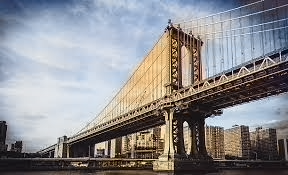
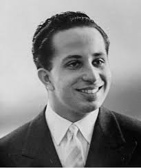
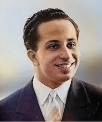
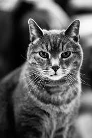
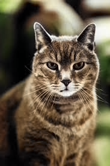

# python-image-colorization

Automatic colorization of black and white images using Python and OpenCV’s DNN module (with a pre-trained Caffe model).  
This project helps bring old grayscale / historical photos to life by generating plausible color versions.

## 📦 What’s inside  

- `models/` — pretrained model files (Caffe prototxt, weights, cluster center files) needed to perform colorization.  
- `pics/` — sample black-and-white input images.  
- Main script — the Python code that loads a B&W image, runs the model, and saves a colorized image.  
- Requirements: Python, OpenCV, NumPy, etc.  

## ⚙️ Requirements  

- Python 3.x  
- `opencv-python`, `numpy`, `matplotlib`   
- Pre-trained model files (Caffe `.prototxt`, `.caffemodel`, cluster centers).

## 🚀 How to use  

1. Clone this repository  
2. Ensure the model files are present in the `models/` folder  
3. Run the main script with a grayscale image

## 🖼️ Results

Below are some example results generated by the image colorization model.  

### Before & After Examples

| Grayscale Input | Colorized Output |
|-----------------|------------------|
|  |  |
|  |  |
|  |  |
